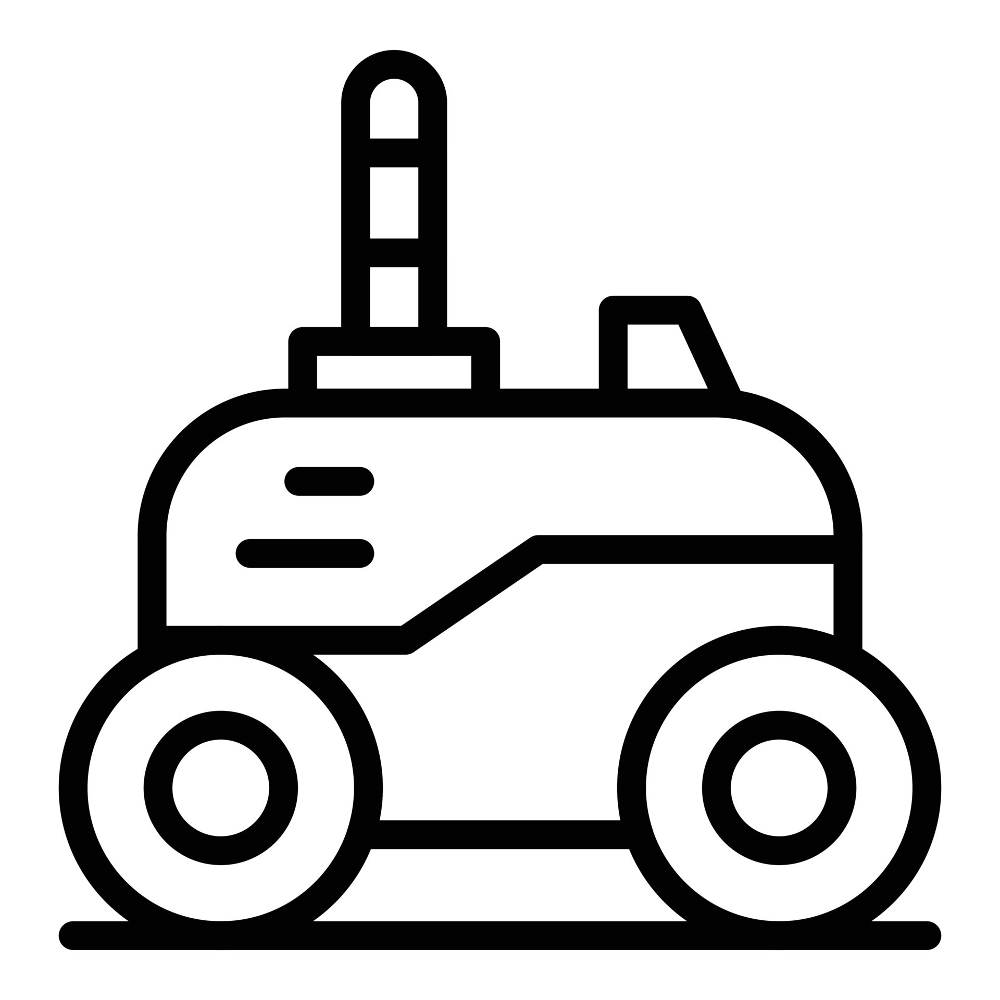

# Self-Learning_IOT_Remainder Project

# Description
This project involved creating a system which sends remainders to the user whenever 
they missed a task. Amazon Web Service will be used with an IOT device to send emails or text messages to the user whenever a task is approaching or missed.   

# Table of Contents

# How to Install and Run the Project

# How to Use the Project
Buy the product, which will use a microcontroller. You will need an AWS account to connect to your micro controller. As for the microcontroller, we will be using an ES32 C3. You will ne

# Credits

# Testing Something
## testing something new

What to write about
- talk about power saving
- sensors
- 

# Use Case
The IOT remainder is a general purpose remainder device where a user action need to be reminded based on a time schedule. The unique feature of this remainder system is that it has the algorithm to learn the activation schedule based on the usage.
The device record user events and sends the time stamp to the server. The device also has ability to recieve messages from the server.  The events are stored in a time series database. Both the server and the device has the algorithm to learn the event schedule based on the usage pattern. 

Image testing
