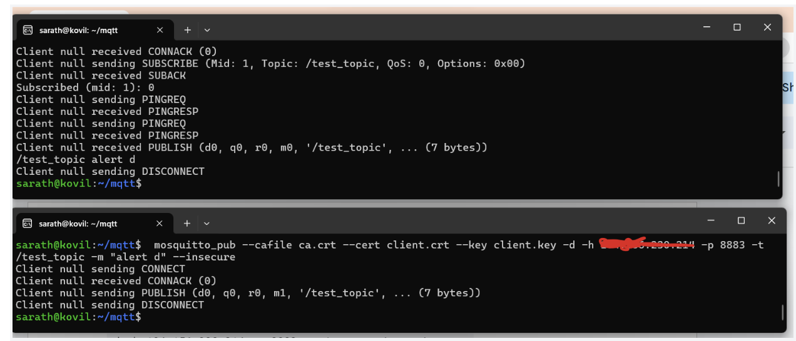
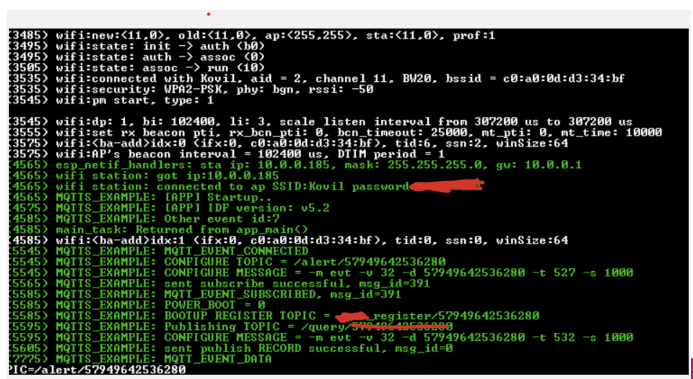

# Self-Learning_IOT_Remainder Project

# Description
This project involved creating a system which sends remainders to the user whenever 
they missed a task. Amazon Web Service will be used with an IOT device to send emails or text messages to the user whenever a task is approaching or missed.   

# Table of Contents

# How to Install and Run the Project

# How to Use the Project
Buy the product, which will use a microcontroller. You will need an AWS account to connect to your micro controller. As for the microcontroller, we will be using an ES32 C3. You will ne

# Credits

# Testing Something
## testing something new

What to write about
- talk about power saving
- sensors
- 

# Use Case
The IOT remainder is a general purpose remainder device where a user action need to be reminded based on a time schedule. The unique feature of this remainder system is that it has the algorithm to learn the activation schedule based on the usage.
The device record user events and sends the time stamp to the server. The device also has ability to recieve messages from the server.  The events are stored in a time series database. Both the server and the device has the algorithm to learn the event schedule based on the usage pattern. 

Image testing

# Design Goals
1. Secure low coast IoT Module 
2. Ultra low power operation for years of batery life
3. Self-Learning Event Pattern inside the device and in the server
4. Machine Learning based Analysis of the event patterns

# Hardware Design
ESP32 C3 is selected as the target microprocessor. It is a Wi-Fi and Bluetooth microcontroller System on Chip(SoC). It is derived from RISC-V architecture.

I decided to use ESP32 devkit M1 as a prototyping board. 

# Prototyping Schematic

//Insert Image Here

I found out that even after putting the ESP32C3 in deep sleep, it was still consuming way more than the sleep currentspecified by the datasheet.

# Final Schematic (FUSION 360)

In this schematic, the usb chip for serial communication is excluded to minimize the sleep current. Instead, the J tag pins are extended through the 6 pin connector. 

# PCB Assembly
After completing the layout , I created a home made PCB using copper clad board available from Amazon along with etching chemicals. 

// Insert Image

# Programming and debug interface 
Since the main board doesn't have the CP2102 USB chip for programming interface and debugging, I used the Dev Kit and removed the ESP32 chip from it and interfaced as shown below. 

# MQTT Client Server Setup
I used the station example from the ESP32 sdk folder. The station example allows us to connect to the wifi network. 

# TO DO
1. Once I was able to connect the module with the home network. In the station_example_main.c, please make sure to change the ssid and password as shown below.

#define EXAMPLE_ESP_WIFI_SSID      "YOURSSID"//CONFIG_ESP_WIFI_SSID
#define EXAMPLE_ESP_WIFI_PASS      "YOURPASSWORD" //CONFIG_ESP_WIFI_PASSWORD

For MQTT reference code, I used SSL_mutual_auth which is the highest form of secure authentication 

# Setting up of TLS Certificate
I used this weblink to create certificate. 

http://www.steves-internet-guide.com/install-mosquitto-linux/

http://www.steves-internet-guide.com/creating-and-using-client-certificates-with-mqtt-and-mosquitto/

However, it was trcky to have it right, so I am detailing the exact step that I followed. 

The first link explains the installations of mosquito and the second one eplains how to install the certificate for client and server.
I used an UBUNTU PC as a server connected to my home LAN. 

We create our own self signed CA and create client and server certificate using this CA. 

Generate CA Key
 **openssl genrsa -des3 -out ca.key 2048**
	Enter PEM   dummy

Keep note of the "dummy". We will need to use it later

**openssl req -new -x509 -days 1826 -key ca.key -out ca.crt**

*Enter pass phrase for ca.key:
You are about to be asked to enter information that will be incorporated
into your certificate request.
What you are about to enter is what is called a Distinguished Name or a DN.
There are quite a few fields but you can leave some blank
For some fields there will be a default value,
If you enter '.', the field will be left blank.*

Country Name (2 letter code) [AU]:US
State or Province Name (full name) [Some-State]:CALIFORNIA
Locality Name (eg, city) []:MILPITAS
Organization Name (eg, company) [Internet Widgits Pty Ltd]:IOT_Remainder
Organizational Unit Name (eg, section) []:IOT_Remainder
Common Name (e.g. server FQDN or YOUR name) []:SARATH
Email Address []:

IMPORTANT: Not the common name given, in this case Sarath. Make sure it is the same name that we should use for all certificates

Generate Server Key
 **openssl genrsa -out server.key 2048**

Generate Server CSR ( using server.key )
 **2320  openssl req -new -out server.csr -key server.key**

*Country Name (2 letter code) [AU]:US
State or Province Name (full name) [Some-State]:CALIFORNIA
Locality Name (eg, city) []:MILPITAS
Organization Name (eg, company) [Internet Widgits Pty Ltd]:IOT_Remainder
Organizational Unit Name (eg, section) []:ka
Common Name (e.g. server FQDN or YOUR name) []:SARATH
Email Address []:

Please enter the following 'extra' attributes
to be sent with your certificate request
A challenge password []:
An optional company name []:*

Create a server certificate with CSR (  CA.cert  + CA.key  + server.csr )ok

 **openssl x509 -req -in server.csr -CA ca.crt -CAkey ca.key -CAcreateserial -out server.crt -days 10000**

Copy this certificate into the Ubuntu Server where MQTT is installed.
   **sudo cp server.crt  /etc/mosquitto/certs/**
   **sudo cp server.key  /etc/mosquitto/certs/**
   **sudo cp ca.crt  /etc/mosquitto/certs/**

Edit below file and make sure that the certificate path matches the location where we copied the certificate

/etc/mosquitto/mosquitto.conf

## Creating Client Certificate

Create client key
 **2334  openssl genrsa -out client.key 2048**
Create Client CSR 

 **openssl req -new -out client.csr -key client.key**

* Country Name (2 letter code) [AU]:US
State or Province Name (full name) [Some-State]:CALIFORNIA
Locality Name (eg, city) []:MILPITAS
Organization Name (eg, company) [Internet Widgits Pty Ltd]:IOT_Remainder
Organizational Unit Name (eg, section) []:IOT_Remainder
Common Name (e.g. server FQDN or YOUR name) []:SARATH
Email Address []:

Please enter the following 'extra' attributes
to be sent with your certificate request
A challenge password []:
An optional company name []: *

** openssl x509 -req -in client.csr -CA ca.crt -CAkey ca.key -CAcreateserial -out client.crt -days 800 **

Copy CA.crt, Client.crt, and Client.key inside the main folder of the ESP32 project.

Edit CMAKELists.txt as below

*
#The following five lines of boilerplate have to be in your project's
#CMakeLists in this exact order for cmake to work correctly
cmake_minimum_required(VERSION 3.16)

include($ENV{IDF_PATH}/tools/cmake/project.cmake)
project(wifi_station)

target_add_binary_data(${CMAKE_PROJECT_NAME}.elf "main/client.crt" TEXT)
target_add_binary_data(${CMAKE_PROJECT_NAME}.elf "main/client.key" TEXT)
target_add_binary_data(${CMAKE_PROJECT_NAME}.elf "main/ca.crt" TEXT)
*

Find out the IP address of the UBUNTU server and update below function with correct IP address
Make sure to make appropriate changes 

*
static void mqtt_app_start(void)
{
  const esp_mqtt_client_config_t mqtt_cfg = {
    //.broker.address.uri = "mqtts://test.mosquitto.org:8884",
	.broker.address.uri = "mqtts://xxx.xxx.xxx.xxx:xxxx",
    .broker.verification.certificate = (const char *)server_cert_pem_start,
	.broker.verification.skip_cert_common_name_check = 1,
    .credentials = {
      .authentication = {
        .certificate = (const char *)client_cert_pem_start,
        .key = (const char *)client_key_pem_start,
      },
    }
  };
  *

## Starting the mosquito broker 

**sudo mosquitto -c /etc/mosquitto/mosquitto.conf**

## Testing the mosquito broker with client certificate
Open a command shell and type below command.
 ***mosquitto_sub -C 1   -v  --cafile ca.crt --cert client.crt --key client.key -d -h xxx.xxx.xxx.xxx -p 8883 -t /test_topic  --insecure***

Open another command shell and publish the message "alert"

 **mosquitto_pub --cafile ca.crt --cert client.crt --key client.key -d -h xxx.xxx.xxx.xxx -p 8883 -t /test_topic -m "alert d" --insecure**

Make sure to copy the CA.crt, Client.key, and Client.crt to the folder from where we run the command

Since we have validated the certificate using the above method, we can compile the MQTT example code and run it. Connect a serial terminal and set the baud rate to 15200. The MQTT connection log will be similar to the screenshot shown below.

